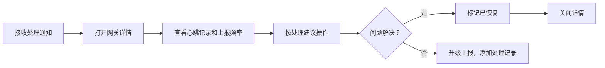

## 1. 产品概述

采集网关状态监控大屏，为运维团队提供网关设备实时状态可视化监控与问题处理平台。解决网关设备分散、故障发现滞后、处理流程不规范等问题。

- 目标用户：值班运维、现场技术人员、项目经理
- 核心价值：实时监控网关运行状态，快速定位并处理异常，按项目维度汇总健康状况

## 2. 核心功能

### 2.1 用户角色

| 角色 | 权限说明 | 核心操作 |
|------|----------|----------|
| 值班运维 | 全局视图 + 操作权限 | 查看状态总览、网关列表、处理告警、标记恢复、刷新数据 |
| 现场技术 | 详情视图 + 处理权限 | 查看网关详情、心跳记录、上报频率、执行处理建议、添加处理记录 |
| 项目经理 | 项目概览视图 | 按项目维度查看健康概览、统计报表、处理进度 |

### 2.2 功能模块

1. **状态总览区**：在线/离线/超时/告警数量统计卡片
2. **网关列表区**：分页展示网关设备，支持多维度筛选
3. **详情抽屉**：点击网关行展开，显示心跳历史、上报频率、处理建议
4. **告警筛选器**：按状态、项目、告警级别、时间范围筛选
5. **处理记录面板**：展示所有网关的处理历史记录
6. **项目健康概览**：按项目分组展示健康度统计
7. **刷新提示**：手动刷新按钮，保留筛选条件，显示上次刷新时间

### 2.3 页面详情

| 页面名称 | 模块名称 | 功能描述 |
|-----------|-------------|---------------------|
| 状态监控大屏 | 状态总览卡片 | 四类状态数量实时展示，点击可联动筛选 |
| 状态监控大屏 | 告警筛选器 | 状态下拉、项目多选、告警级别、时间范围选择 |
| 状态监控大屏 | 网关列表 | 表格展示网关基本信息、状态标签、告警标记、操作按钮 |
| 状态监控大屏 | 详情抽屉 | 右侧滑出，含心跳时间线、上报频率图表、处理建议步骤 |
| 状态监控大屏 | 处理记录 | 可折叠面板，展示处理历史、处理人、处理时间、处理结果 |
| 状态监控大屏 | 项目概览切换 | Tab切换，按项目维度展示健康度仪表盘 |
| 状态监控大屏 | 刷新控制 | 手动刷新按钮 + 自动刷新开关 + 上次刷新时间 |

## 3. 核心流程

### 3.1 值班运维监控流程

### 3.2 现场技术处理流程

### 3.3 项目经理查看流程

## 4. 用户界面设计

### 4.1 设计风格

- **设计理念**：工业风科技感（Industrial Tech），深色主题，运维监控场景
- **主色调**：深灰蓝 `#0f172a` 作为背景，营造专业监控氛围
- **状态色**：
  - 在线：荧光绿 `#22c55e` - 正常运行
  - 离线：警示红 `#ef4444` - 已失去连接
  - 超时：警示橙 `#f59e0b` - 心跳延迟
  - 告警：亮紫 `#a855f7` - 存在告警事件
- **辅助色**：青蓝 `#06b6d4` 用于交互元素、银灰 `#94a3b8` 用于次文本
- **字体**：
  - 数字显示：`JetBrains Mono` 等宽字体，增强科技感
  - 正文：`Noto Sans SC` 清晰易读
- **布局风格**：卡片式网格布局，硬朗边角，细边框分隔
- **动效**：状态脉冲呼吸动效、数字滚动、抽屉滑入、数据刷新淡入淡出

### 4.2 页面设计概览

| 页面名称 | 模块名称 | UI 元素 |
|-----------|-------------|-------------|
| 状态监控大屏 | 状态总览卡片 | 渐变背景卡、大字号数字、状态图标脉冲动效、点击态缩放 |
| 状态监控大屏 | 网关列表 | 斑马纹表格、状态标签、告警角标、hover 高亮、行点击展开抽屉 |
| 状态监控大屏 | 详情抽屉 | 右侧滑入遮罩、心跳时间线、频率折线图、步骤式处理建议 |
| 状态监控大屏 | 告警筛选器 | 标签式筛选器、日期范围选择器、联动即时生效 |
| 状态监控大屏 | 处理记录 | 可折叠时间线、处理人头像、状态流转标签 |
| 状态监控大屏 | 刷新控制 | 旋转刷新图标、倒计时自动刷新、toast 提示 |

### 4.3 响应式设计

- **桌面端优先**：1920px 宽度优化，适配监控大屏
- **平板适配**：1024px 断点，卡片自适应宽度，抽屉改为底部弹出
- **关键交互优化**：触摸目标不小于 44x44px，手势支持关闭抽屉

## 5. 核心交互规则

### 5.1 业务规则

1. **心跳超时转离线**：网关最后心跳时间超过设定阈值（默认5分钟），状态自动从"超时"变为"离线"
2. **离线不可恢复**：状态为"离线"的网关，"恢复"按钮自动禁用，需先排查连接问题
3. **筛选条件保留**：手动刷新数据时，当前所有筛选条件保持不变
4. **状态优先级**：告警 > 离线 > 超时 > 在线（当存在多个状态时显示最高优先级）

### 5.2 验证场景

- **场景1**：载入一个心跳超时（超过设定分钟数）的网关，验证其状态自动变为"离线"，且恢复按钮不可用
