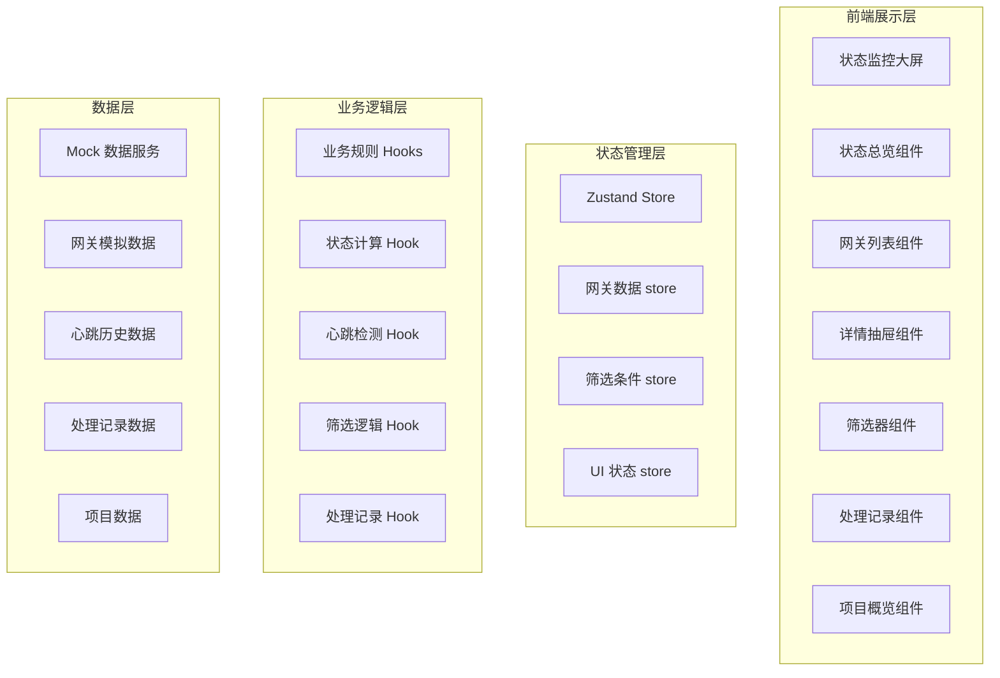

## 1. 架构设计



## 2. 技术描述

- **前端框架**：React@18 + TypeScript
- **构建工具**：Vite@5
- **样式方案**：TailwindCSS@3
- **状态管理**：Zustand
- **路由**：React Router DOM（单页面，Hash 模式）
- **图表库**：Recharts（用于上报频率折线图）
- **图标库**：Lucide React
- **日期处理**：date-fns
- **后端**：无，纯前端 Mock 数据
- **数据库**：无，内存模拟 + localStorage 持久化

## 3. 路由定义

| 路由 | 用途 |
|-------|---------|
| / | 状态监控大屏主页面 |
| /project/:projectId | 项目维度健康概览 |

## 4. 数据模型

### 4.1 核心数据结构

```mermaid
erDiagram
    GATEWAY ||--o{ HEARTBEAT : "has"
    GATEWAY ||--o{ ALERT : "may have"
    GATEWAY ||--o{ PROCESS_RECORD : "has"
    PROJECT ||--o{ GATEWAY : "contains"
    
    GATEWAY {
        string id "网关ID"
        string name "网关名称"
        string code "网关编码"
        string ip "IP地址"
        string projectId "所属项目ID"
        string status "状态：online/offline/timeout/alert"
        datetime lastHeartbeat "最后心跳时间"
        number reportFrequency "上报频率（秒）"
        string location "位置"
        string version "固件版本"
    }
    
    HEARTBEAT {
        string id "记录ID"
        string gatewayId "网关ID"
        datetime timestamp "心跳时间"
        number latency "延迟（ms）"
        string status "心跳状态"
    }
    
    ALERT {
        string id "告警ID"
        string gatewayId "网关ID"
        string level "级别：critical/warning/info"
        string message "告警信息"
        datetime createdAt "产生时间"
        boolean resolved 是否已解决
    }
    
    PROCESS_RECORD {
        string id "记录ID"
        string gatewayId "网关ID"
        string operator "处理人"
        string action "处理动作"
        string result "处理结果"
        datetime createdAt "处理时间"
    }
    
    PROJECT {
        string id "项目ID"
        string name "项目名称"
        string description "项目描述"
    }
```

### 4.2 TypeScript 类型定义

```typescript
// 网关状态枚举
export type GatewayStatus = 'online' | 'offline' | 'timeout' | 'alert';

// 告警级别
export type AlertLevel = 'critical' | 'warning' | 'info';

// 网关接口
export interface Gateway {
  id: string;
  name: string;
  code: string;
  ip: string;
  projectId: string;
  status: GatewayStatus;
  lastHeartbeat: Date;
  reportFrequency: number;
  location: string;
  version: string;
  alerts: Alert[];
}

// 心跳记录
export interface HeartbeatRecord {
  id: string;
  gatewayId: string;
  timestamp: Date;
  latency: number;
  status: 'success' | 'failed';
}

// 告警信息
export interface Alert {
  id: string;
  gatewayId: string;
  level: AlertLevel;
  message: string;
  createdAt: Date;
  resolved: boolean;
}

// 处理记录
export interface ProcessRecord {
  id: string;
  gatewayId: string;
  operator: string;
  action: string;
  result: string;
  createdAt: Date;
}

// 项目信息
export interface Project {
  id: string;
  name: string;
  description: string;
}

// 筛选条件
export interface FilterOptions {
  status: GatewayStatus | 'all';
  projectId: string | 'all';
  alertLevel: AlertLevel | 'all';
  timeRange: [Date, Date] | null;
  keyword: string;
}

// 状态统计
export interface StatusStats {
  online: number;
  offline: number;
  timeout: number;
  alert: number;
  total: number;
}
```

## 5. 核心模块设计

### 5.1 状态管理 Store

```typescript
// useGatewayStore - 网关数据管理
- 网关列表增删改查
- 状态统计计算
- 心跳更新处理

// useFilterStore - 筛选条件管理
- 筛选条件持久化
- 筛选条件重置
- 刷新时保留筛选

// useUIStore - UI状态管理
- 抽屉开关
- 当前选中网关
- 刷新状态
- 加载状态
```

### 5.2 自定义 Hooks

```typescript
// useGatewayStatus - 网关状态计算
- calculateStatus(): 根据最后心跳计算状态
- isOfflineAllowed(): 判断是否允许标记恢复
- checkTimeout(): 超时检测

// useHeartbeat - 心跳管理
- startHeartbeatMonitor(): 启动心跳监听
- stopHeartbeatMonitor(): 停止监听
- getHeartbeatHistory(): 获取心跳历史

// useFilter - 筛选逻辑
- applyFilters(): 应用筛选条件
- saveFilters(): 保存筛选条件
- restoreFilters(): 恢复筛选条件

// useProcessRecord - 处理记录
- addProcessRecord(): 添加处理记录
- getProcessRecords(): 获取处理记录
```

### 5.3 核心业务规则实现

```typescript
// 规则1：心跳超时转离线
// 阈值：默认 5 分钟（可配置）
const OFFLINE_THRESHOLD = 5 * 60 * 1000;

export function calculateGatewayStatus(lastHeartbeat: Date, hasAlerts: boolean): GatewayStatus {
  if (hasAlerts) return 'alert';
  
  const now = new Date();
  const diff = now.getTime() - lastHeartbeat.getTime();
  
  if (diff > OFFLINE_THRESHOLD) return 'offline';
  if (diff > 60 * 1000) return 'timeout'; // 超过1分钟为超时
  return 'online';
}

// 规则2：离线网关不可恢复
export function canMarkAsRecovered(status: GatewayStatus): boolean {
  return status !== 'offline';
}

// 规则3：刷新保留筛选
// 通过 useFilterStore 持久化筛选条件到 localStorage
// 刷新时从 localStorage 恢复
```

## 6. 项目目录结构

```
src/
├── components/
│   ├── StatusOverview/      # 状态总览卡片
│   │   ├── StatusCard.tsx
│   │   └── index.tsx
│   ├── GatewayList/         # 网关列表
│   │   ├── GatewayTable.tsx
│   │   ├── GatewayRow.tsx
│   │   └── index.tsx
│   ├── GatewayDetail/       # 详情抽屉
│   │   ├── DetailDrawer.tsx
│   │   ├── HeartbeatTimeline.tsx
│   │   ├── FrequencyChart.tsx
│   │   └── ActionSteps.tsx
│   ├── FilterBar/           # 筛选器
│   │   ├── StatusFilter.tsx
│   │   ├── ProjectFilter.tsx
│   │   └── index.tsx
│   ├── ProcessRecords/      # 处理记录
│   │   ├── RecordTimeline.tsx
│   │   └── index.tsx
│   ├── ProjectOverview/     # 项目概览
│   │   ├── ProjectCard.tsx
│   │   └── index.tsx
│   ├── RefreshControl/      # 刷新控制
│   │   └── index.tsx
│   └── common/              # 公共组件
│       ├── StatusBadge.tsx
│       ├── AlertBadge.tsx
│       └── EmptyState.tsx
├── hooks/
│   ├── useGatewayStatus.ts
│   ├── useHeartbeat.ts
│   ├── useFilter.ts
│   └── useProcessRecord.ts
├── store/
│   ├── gatewayStore.ts
│   ├── filterStore.ts
│   └── uiStore.ts
├── data/
│   ├── mockGateways.ts
│   ├── mockHeartbeats.ts
│   ├── mockProjects.ts
│   └── mockRecords.ts
├── types/
│   └── index.ts
├── utils/
│   ├── statusUtils.ts
│   ├── dateUtils.ts
│   └── filterUtils.ts
├── pages/
│   ├── Dashboard.tsx
│   └── ProjectView.tsx
├── App.tsx
├── main.tsx
└── index.css
```

## 7. 验证方案

### 7.1 核心规则验证

**验证场景1：超时网关自动转离线，恢复按钮不可用**

1. 准备测试数据：创建一个网关，设置 `lastHeartbeat` 为 10 分钟前（超过5分钟阈值）
2. 页面加载，检查网关状态显示为"离线"（红色标签）
3. 点击该网关打开详情抽屉
4. 检查"标记恢复"按钮为禁用状态（灰色，不可点击）
5. 检查按钮 Tooltip 提示："离线网关需先恢复连接"

### 7.2 其他规则验证

- **筛选保留**：设置筛选条件后点击刷新，验证筛选条件未重置
- **状态优先级**：创建一个同时有告警和超时的网关，验证显示"告警"状态
